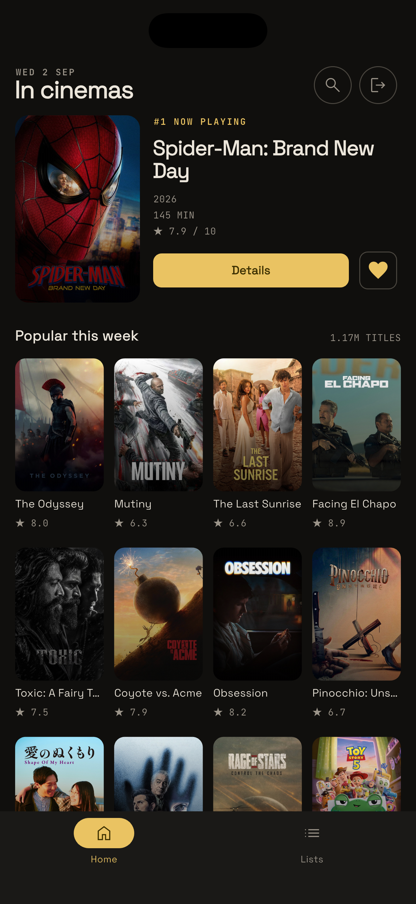
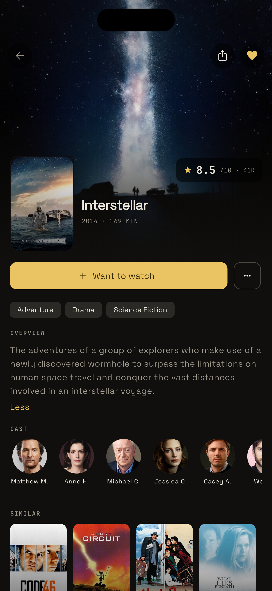
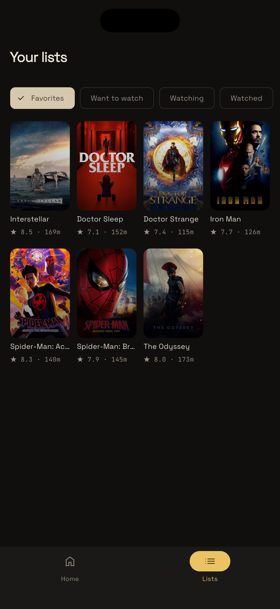
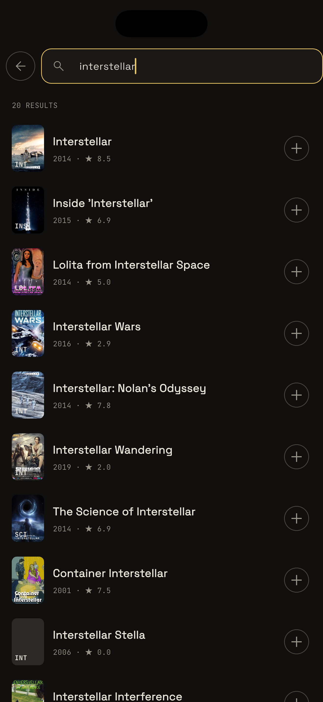

# Marquee


A flutter project that displays movies from [The Movie Database](https://www.themoviedb.org/) (TMDB) API, with features like searching movies, adding to watchlists and favorites

## Screenshots

| Home                                                                                   | Movie Details                                                                          | Lists                                                                                  | Search                                                                                 |
| -------------------------------------------------------------------------------------- | -------------------------------------------------------------------------------------- | -------------------------------------------------------------------------------------- | -------------------------------------------------------------------------------------- |
|  |  |  |  |

## Running the app

1. Install [Flutter](https://docs.flutter.dev/install) 3.47 or newer and set up an Android or iOS device

2. Clone the repo and install dependencies:

   ```bash
   git clone https://github.com/Andrew-Bekhiet/marquee.git
   cd marquee
   flutter pub get
   dart run build_runner build
   dart run sqflite_common_ffi_web:setup
   ```

3. Follow the [TMDB getting started guide](https://developer.themoviedb.org/docs/getting-started) to get an API Read Access Token.
4. The Firebase configuration for the current project is included in the repo. To use your own project, follow the [FlutterFire setup guide](https://firebase.google.com/docs/flutter/setup), then [enable Email/Password authentication](https://firebase.google.com/docs/auth/flutter/password-auth).
5. Run the app with your TMDB token:

   ```bash
   flutter run --dart-define=TMDB_ACCESS_TOKEN=<your_access_token>
   ```

## Features

1. Shows latest movie playing in cimemas
2. Shows this week's most popular movies
3. Favorites list
4. Want to watch list, watching list, and watched list
5. Searching for movies
6. Login & Signup

## Technologies used

1. Flutter
2. Firebase Authentication
3. [The Movie Database](https://www.themoviedb.org/)
4. SQLite

## Packages used

1. [firebase_auth](https://pub.dev/packages/firebase_auth) and [firebase_core](https://pub.dev/packages/firebase_core) for authentication
2. [bloc](https://pub.dev/packages/bloc), [flutter_bloc](https://pub.dev/packages/flutter_bloc) and [equatable](https://pub.dev/packages/equatable) for state management
3. [provider](https://pub.dev/packages/provider) for dependency injection
4. [sqflite](https://pub.dev/packages/sqflite) and [path](https://pub.dev/packages/path) for local persistence
5. [dio](https://pub.dev/packages/dio) & [retrofit](https://pub.dev/packages/retrofit) for making network requests
6. [json_serializable](https://pub.dev/packages/json_serializable) for generating model classes from JSON
7. [cached_network_image](https://pub.dev/packages/cached_network_image) for caching network images
8. [flutter_launcher_icons](https://pub.dev/packages/flutter_launcher_icons) for generating launcher icons
9. [flutter_native_splash](https://pub.dev/packages/flutter_native_splash) for generating native splash screens
10. [google_fonts](https://pub.dev/packages/google_fonts) for using Google Fonts in the app
11. [intl](https://pub.dev/packages/intl) for useful number and date formatting utilities
12. [collections](https://pub.dev/packages/collections) for useful collection utilities
13. [rxdart](https://pub.dev/packages/rxdart) for useful streams utilities
14. [share_plus](https://pub.dev/packages/share_plus) for sharing content from the app
15. [kaisel](https://pub.dev/packages/kaisel) for modern navigation using Dart 3 exhaustive pattern matching
16. [boxy](https://pub.dev/packages/boxy) for implementing custom appbar with nice animation
17. [material_ui](https://pub.dev/packages/material_ui) and [material_symbols_icons](https://pub.dev/packages/material_symbols_icons) for using modern Material Design icons and components
18. [solid_lints](https://pub.dev/packages/solid_lints) for high quality SOLID and clean code lints
    TODO: explain modern dart & flutter features used in the repo with links to docs (primary constructors, enhanced enums, material_ui package, pattern matching for variables promotion)

## Modern dart features used

Most features here require Dart 3.13+ to work

1. [Primary constructors](https://dart.dev/language/primary-constructors)
2. [Enhanced enums](https://dart.dev/language/enums#declaring-enhanced-enums)
3. [material_ui](https://pub.dev/packages/material_ui) package for decoupling design system from flutter, see <https://github.com/flutter/flutter/issues/101479> and <https://docs.google.com/document/d/189AbzVGpxhQczTcdfJd13o_EL36t-M5jOEt1hgBIh7w/edit?usp=sharing>
4. [Pattern matching](https://dart.dev/language/patterns)

## Architecture

The app follows a simplified clean architecture pattern with bloc state management, where modules depend on each other in a linear way like this:

```
UI -> Cubit -> Repository -> DataSource/API
```

- **UI**: soted in `widgets/`, `screens/` and `navigation/` directories, end user interface, interacts with cubits to get state and send events
- **Cubit**: stored in `cubit/` directory, responsible for managing state and business logic, interacting with repositories and exposing state to the UI
- **Repository**: stored in `repositories/` directory. Provides a domain interface for interacting with data sources and APIs, and handles data transformation
- **DataSource/API**: stored in `data_sources/` and `api/` directories, responsible for fetching data from local or remote sources like SQLite or TMDB API

In addition to `models/` which are shared between domain and data layers. In a bigger app, this wouldn't be the case, but since this app is small enough, I decided it's a good tradeoff

Also `utils/` directory contains utility classes and functions that are used throughout the app, like date formatting, number formatting, etc

Each of these subdirectories are grouped by feature like `home/`, `lists/`, `movies/`, `search/`

## Project structure

```text
lib/
├── auth/       # Firebase authentication, login and signup
├── home/       # Home screen and featured movies
├── lists/      # Favorites, watch lists and sqflite
├── movies/     # TMDB API, movie models and details
├── search/     # Movie search
├── shared/     # Routing, theme and shared widgets
├── firebase_options.dart
└── main.dart
```

## Database flow

1. Firebase Authentication stores the user account

2. Favorites and watch lists are stored in the local `movie_lists.db` SQLite database

3. Each row includes the Firebase user ID, list name and movie data required for display in the list
4. User id is tored so that switching accounts doesn't show the same lists for all users
5. Want to watch, Watching and Watched are lists are mutually exclusive

## Application flow

1. The app initializes Firebase and opens the SQLite database
2. The router opens Login when there is no Firebase user, otherwise it opens Home
3. Login and Signup update the authentication stream, which redirects to Home
4. Home loads now playing and popular movies from TMDB
5. Search finds movies by title and can add them to Want to watch
6. Movie Details loads details, cast and similar movies, and manages the selected movie lists
7. The bottom navigation allows switching between Home and Lists
8. Signing out clears the Firebase session and returns to Login

## TMDB attribution

This product uses the TMDB API but is not endorsed or certified by [TMDB](https://www.themoviedb.org/).
